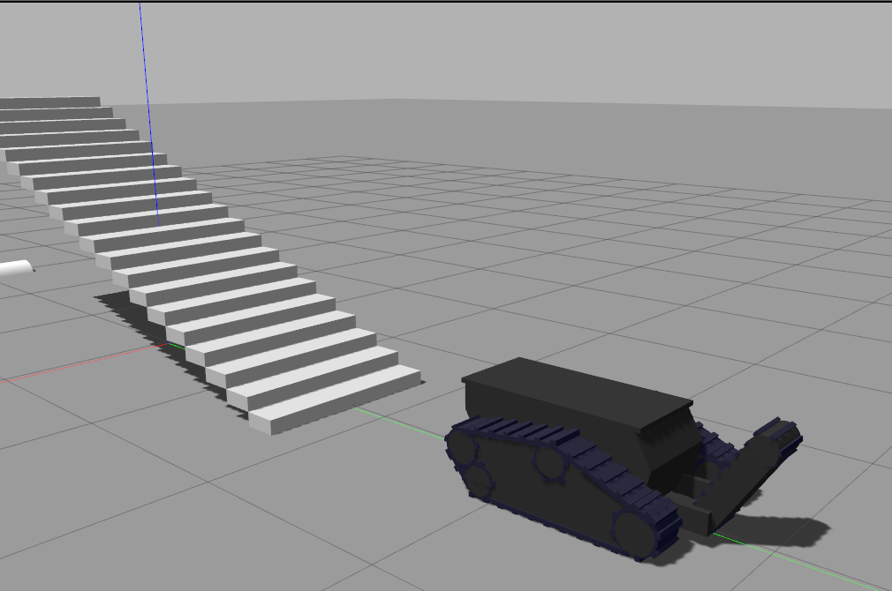
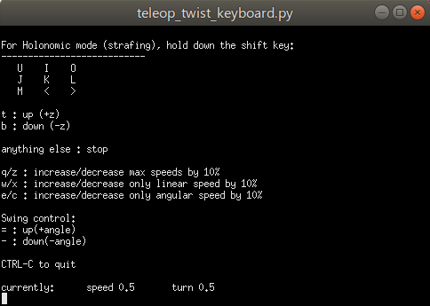

# LandeShaker Simulation
 - 双履带转动功能仿真
 - 摇臂转动、摆动功能仿真
 - 仿真环境效果如下


 
## 1. Installation dependences
```
sudo apt install xterm 
sudo apt install ros-melodic-husky*
sudo apt install ros-melodic-velocity-controllers
sudo apt install ros-melodic-effort-controllers
sudo apt install ros-melodic-control*
```

## 2. Clone relative packages
```
cd <your-ros-ws>/src
git clone https://git.nrs-lab.com/liyuxiang19D/gazebo_tracked_vehicle.git
cd ..
catkin_make
source ./devel/setup.bash
```

## 3. Run examples
```
roslaunch gazebo_continuous_track_example gazebo_tracked_vehicle.launch 
```
 - 在xterm中按键移动机器人、控制尾板


 


## 4. Fast exiting gazebo
```
pkill -9 gzserver && pkill -9 gzclient
```